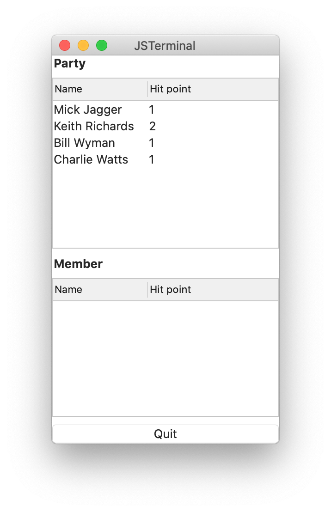

# Table component
The table is used to present the content of database. 
The content of the database is defined by table object.
See [ValueTable](https://github.com/steelwheels/KiwiScript/blob/master/KiwiLibrary/Document/Class/ValueTable.md),
[ContactTable](https://github.com/steelwheels/KiwiScript/blob/master/KiwiLibrary/Document/Class/ContactTable.md).



## Syntax
````
table: Table {
    init: Init %{
        // Setup the table data
        let table = ...
        // Set table into this view
        self.store(table) ;
    %}
    pressed: Event(col: Int, row: Int) %{
        console.log("clicked col=" + col + ", row=" + row) ;
    %}
}
````

## Property values
|Property name  |Type           |Description        |
|:--            |:--            |:--                | 
|rowCount       |Int            |Number of rows in table (Reference only)|
|columnCount    |Int            |Number of columns in table (Reference only)|
|hasHeader      |Bool           |The visibility of column title view|
|fieldNames     |[string]       |Active field names |

The `fieldNames` property is used to choose the fields to display in the table. If you don't set anything to this, all fields in the record are displayed in the table.

## Method

### `pressed`
The event method to accept clicked event:
````
pressed: Event(col: Int, row: Int) %{
%}
````
The parameter is `col` and `row` which presents the location of clicked cell.

## Sample
````
table: Table {
    init: Init %{
        let storage = ValueStorage("storage") ;
	if(storage == null){
		console.log("Failed to allocate storage") ;
	}
	let table = ValueTable("data", storage) ;
	if(table == null){
		console.log("Failed to allocate table") ;
	}
        // Set table into this view
        self.store(table) ;
    %}
    pressed: Event(col: Int, row: Int) %{
        console.log("clicked col=" + col + ", row=" + row) ;
    %}
}
````

# Reference
* [Library](https://github.com/steelwheels/KiwiCompnents/blob/master/Document/Library.md): The list of components. 
* [README](https://github.com/steelwheels/KiwiCompnents): Top page of KiwiComponents project.
* [Steel Wheels Project](https://steelwheels.github.io): Developer's web site

